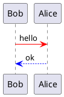
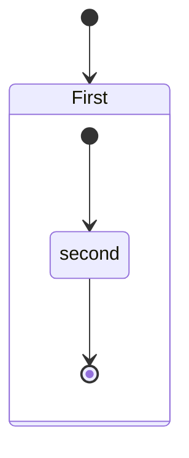

---
# Configuration de Markdown Preview Enhanced
print_background: true # Pour l'export en HTML qu'il prenne le thème de la prévisu (par défaut c'est la prévisu de githublight)
title: Explication Markdown
puppeteer:
    format: A4
    printBackground : true
    displayHeaderFooter: true
    margin: # le Header/footer ne prend pas ces paramètres en compte
        top: 2cm
        right: 2cm
        bottom: 2cm
        left: 2cm

    # taille de police requis, car par défaut c'est 0pt
    # id header/footer sont réservés : ph pour page header, pf pour page footer
    headerTemplate: '
      <style>
          #ph, #pf {
              width: 100%;
              font-size: 10pt;
              font-family: "Times New Roman", Times, serif;
              border: 0px solid #c3c3c3;
              margin: 0px 1cm 0px;
          }
          #ph {
            border-bottom-width: 1px;
          }
          #pf {
              border-top-width: 1px;
          }
          #ph > div,
          #pf > div {
              display: flex;
              justify-content: space-between;
          }
      </style>

      <div id="ph">
          <div>
              <div>Nom prenom</div>
              <div>ABC</div>
              <div>Type</div>
          </div>
          <div>
              <div >Nom prenom</div>
              <div></div>
              <div>Type</div>
          </div>
      </div>
    '
    footerTemplate: ' 
      <div id="pf">
          <div class="child">
              <div>Gauche</div>
              <div>
                  <span class="pageNumber"></span>
                  sur
                  <span class="totalPages"></span>
              </div>
              <div>Droite</div>
          </div>
          <div class="child">
              <div>Gauche</div>
              <div>Centre</div>
              <div>
                  <span class="pageNumber"></span>
                  sur
                  <span class="totalPages"></span>
              </div>
          </div>
      </div>
    '
---

@import "style.less" 

<span style="color: purple; font-weight: bold">⚠️ ce document est adapté pour être exporté avec `Markdown Preview Enhanced`⚠️</span> 

# Extensions VSCode

## Markdown all in one
- https://marketplace.visualstudio.com/items?itemName=yzhang.markdown-all-in-one
- TDM
  - `ctrl shift p : >Create table content`
  - va générer la table des matières (sans le titre)
  - Ajouter la balise `<!-- omit from toc -->` au titre pour ne pas l'afficher dans la table des matières
- De bon raccourcis claviers
- Prise en charge de Latex (formules); mermaid; et bien d'autres
- Prévisualisation `ctrl K, V` (**Sa ouvre juste le prévisualiseur de base de VSC**)
  - <span style="color: red">Pas d'émoji de type `:code:`</span> 
  - <span style="color: orange">2 ligne sans espace entre == à la suite du texte (fonctionnement normal de MD)</span> 
  - <span style="color: green">UI simple mais efficace, on vois quel ligne est éditée</span> 
- Export HTML
  - `ctrl shift p : >Print current document to HTML`
  - Passable, mais sans plus (manque un peu de colorisation comparé à la prévisualisation)
  - 1ère ligne du fichier markdown : `<!-- title: Guide Markdown -->` permet de définir le titre de la page HTML, sinon prend le 1er titre
  - <span style="color: red">Ne supporte pas le front-matter (Markdown Preview Enhanced)</span>
  
## Markdown preview enhanced
- https://marketplace.visualstudio.com/items?itemName=shd101wyy.markdown-preview-enhanced
- Toutes les options sont bien expliqué dans la doc : https://github.com/shd101wyy/markdown-preview-enhanced/tree/master/docs
- Prévisualisation `ctrl K, V`
  - Rendu très bien
  - <span style="color: orange">2 ligne sans espace entre == comme si on avait un `<br>` (c'est une option) (fonctionnement normal de `GitHub Flavored Markdown`)</span> 
  - <span style="color: green">gère les notes de bas de page (`[^1]`)</span>
  - <span style="color: green">Checkbox modifiable dans la prévisu</span> 
  - gère la visualisation Latex
  - Exports :
    - <span style="color: green">Export "HTML", le rendu correspond à la prévisualisation</span> (thème de base)
    - Export "Puppeteer" est très puissant, mais demande de la configuration dans le `front-matter`
      - Gère les #page
      - <span style="color: red">Malheureusement, le fichier CSS ne prend pas pour le "headerTemplate" et le "footerTemplate" (il faut configurer directement dans le `front-formatter`.</span>
    - les autres exports sont moyen (demande des installations supplémentaires, non testé)
- <span style="color: red">L'auto-génération de la TOC n'est pas fameuse</span> <span style="color: #46b7ae; font-style: italic; font-size: 0.85rem">// Mais en utilisant celle de `Markdown All in One`, le rendu est top</span> 

## Markdown PDF
- https://marketplace.visualstudio.com/items?itemName=yzane.markdown-pdf
- Pas testé plus que ça, car après configuration des précédentes extensions elle se suffisent. C'était l'extension que j'utilisais avant de tester les autres.
  - La configuration de l'entête et du pied de page se fait dans le fichier de configuration de l'extension (settings.json), ce qui n'est pas fameux pour des informations pour des fichiers spécifiques.
  - Pour afficher les #page c'est pas aisé


## Paste image
- https://marketplace.visualstudio.com/items?itemName=mushan.vscode-paste-image
- `ctrl shift v` : permet de coller une image dans le markdown (remapé, initialement `Ctrl Alt V`)
  
#  Table des matières <!-- omit from toc -->
  
- [Extensions VSCode](#extensions-vscode)
  - [Markdown all in one](#markdown-all-in-one)
  - [Markdown preview enhanced](#markdown-preview-enhanced)
  - [Markdown PDF](#markdown-pdf)
  - [Paste image](#paste-image)
- [1. Numéros de titres](#1-numéros-de-titres)
  - [1.1. Titre 2](#11-titre-2)
    - [1.1.1 Sous titre](#111-sous-titre)
- [2. Titre 3](#2-titre-3)
- [Styles](#styles)
- [Diagrammes](#diagrammes)
  - [PlantUML](#plantuml)
  - [Mermaid](#mermaid)
- [Nouvelle page (HTML / PDF)](#nouvelle-page-html--pdf)
- [Markdown Preview Enhanced](#markdown-preview-enhanced-1)
  - [CSS custom](#css-custom)
- [Divers](#divers)
- [Image](#image)
- [Notes de bas de page](#notes-de-bas-de-page)
  
#  1. Numéros de titres
Mise à jour des # titres auto avec `Markdown All in One` :<br>
`ctrl shift p : >add/update section numbers` pour update
`ctrl shift p : >remove section numbers` pour supprimer
  
##  1.1. Titre 2

### 1.1.1 Sous titre

#### 1.1.1.1 beaucoup de 1
  
#  2. Titre 3

# Styles
- puces
- :smile:
  - 😎
1. abc
2. def
   - ghi
     - jkl

> citation

- [ ] tache
- [x] Faite
   

|             style             |                 code | raccourci (Markdown all in one)            |
| :---------------------------: | -------------------: | ------------------------------------------ |
|           **gras**            |           `**gras**` | `ctrl b`                                   |
|          *italique*           |         `*italique*` | `ctrl i`                                   |
|        <u>souligné</u>        |    `<u>souligné</u>` |
|           ~~barré~~           |          `~~barré~~` | `alt s`                                    |
|            `code`             |         `` `code` `` |
| bloc de code (voir plus bas)  | ` ```type code ``` ` |
|          [lien](...)          |        `[lien](...)` | `ctrl v` un lien en sélectionnant du texte |
|                  |      `` |                                            |
| note de bas de page[^1][^nom] |      `[^1]` `[^nom]` |                                            |
| $\LaTeX : \varphi(n) \rArr x$ |              `$...$` |                                            |


**bloc de code** : 
multiline
```py {.line-numbers}
a = "hello world" 
print(a) 
```

```js
var a = "hello world, avec une très longue ligne de code qui dépasse la largeur de la fenêtre lors de l'exportation en PDF de ce document"
system.out.println(a)
```

> Dans la preview, un slider s'affiche. Pour l'export avec Puppeteer (`Markdown Preview Enhanced`), le texte est tronqué si on ajoute pas cette option dans le css (ajout expliqué [ici](#css-custom)) :
> ```css
> @media print {
>     pre[class*="language-"] {
>         white-space: pre-wrap;
>     }
> }
> ```
> le `@media print` permet de conserver le slider dans la preview`

> les blocs de code pour les types `plantuml` et `mermaid` ne peuvent être affichés tel quel, ils sont convertis en diagrammes, voir [Diagrammes](#diagrammes)

[^1]: note de bas de page #1
[^nom]: bloc de code
  avec plusieurs lignes

# Diagrammes

Si les blocs de code prennent le type `plantuml` ou `mermaid`, ils sont automatiquement interprétés et affichés.

> Du moins pour l'extension `Markdown Preview Enhanced`.

## PlantUML
```
@startuml
Bob -[#red]> Alice : hello
Alice -[#0000FF]->Bob : ok
@enduml
```



## Mermaid
```
stateDiagram
    [*] --> First
    state First {
        [*] --> second
        second --> [*]
    }
```



# Nouvelle page (HTML / PDF)
Faire un saut de page au format pdf ou impression navigateur :
- `<div style="page-break-after: always;"></div>"`, // syntaxe pure HTML
- `<div class="page"></div>` <span style="color: #46b7ae; font-style: italic; font-size: 0.85rem">// Simplification dans notre css, l'extension `markdown-pdf` la contient de base</span>

> <span style="color: #46b7ae; font-style: italic; font-size: 0.85rem">// même si `page-break-after` est marqué comme [déprécié](https://developer.mozilla.org/fr/docs/Web/CSS/break-after), puppeteer ne gère pas le `break-after`</span>

<div class="page"></div>

# Markdown Preview Enhanced

En 1ere ligne du fichier Markdown, possibilité d'utiliser le `front-matter` pour configurer le rendu HTML

```yaml
---
config1: value1
config2: value2
---
```

Configuration possible <span style="color: #46b7ae; font-style: italic; font-size: 0.85rem">(testé)</span>  :

| config                        | description                                    | valeur par défaut               | type                |
| :---------------------------- | :--------------------------------------------- | :------------------------------ | ------------------- |
| title                         | titre de la page                               | nom du fichier sans l'extension | texte               |
| print_background              | utiliser le style du prévisualiseur            | `false`                         | booléen             |
| puppeteer                     | Configuration de l'export "Chrome (Pupeeteer)" | -                               | objet               |
| puppeteer.format              | Taille de la feuille                           | A4                              | A4, A3, Letter, etc |
| puppeteer.margin              | Marge de la page                               | -                               | objet               |
| puppeteer.printBackground     | Afficher les couleurs de background            | `false`                         | booléen             |
| puppeteer.displayHeaderFooter | Afficher les headers et footers                | `false`                         | booléen             |
| puppeteer.headerTemplate      | Template HTML du header                        | -                               | HTML                |
| puppeteer.footerTemplate      | Template HTML du footer                        | -                               | HTML                |

## CSS custom
`C:\Users\[utilisateur]\.mume\style.less` sera la feuille de style par défaut, mais il est possible d'en ajouter de cette manière (ici relatif à ce fichier md) : `@import "css.less"` 
`.css` est aussi valide, mais non visible dans la prévisu.

En cas de modification dans le fichier importé, il est nécessaire de recharger la prévisu pour prendre en compte les changements.

# Divers

Ligne séparatrice : au moins 3 `*` ou `-` ou `_` sur une ligne

***
___
---

# Image

> La taille des deux images ci-après est exactement la même !
> Sauf l'une est horizontale et l'autre verticale (respectivement 2800x1600 et 1600x2800).
> La taille de l'image est adaptée à la largeur de la fenêtre de prévisualisation, ou la taille de l'export PDF.

<!-- https://imgur.com/a/kqEQa8r -->
Une large image :


Une longue image :


Pour redimensionner une image, passer par html plutôt que markdown :

```html

```

# Notes de bas de page
(`Markdown Preview Enhanced`)
Même si elle sont créé avant, elle seront affiché en fin de document
Nommé une note permet de la réutiliser plus facilement, mais son index sera visible dans l'output (HTML, prévisu)
